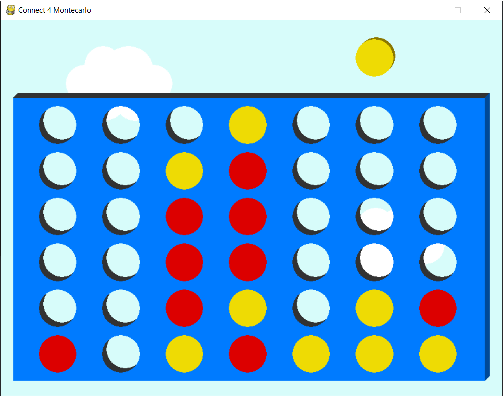
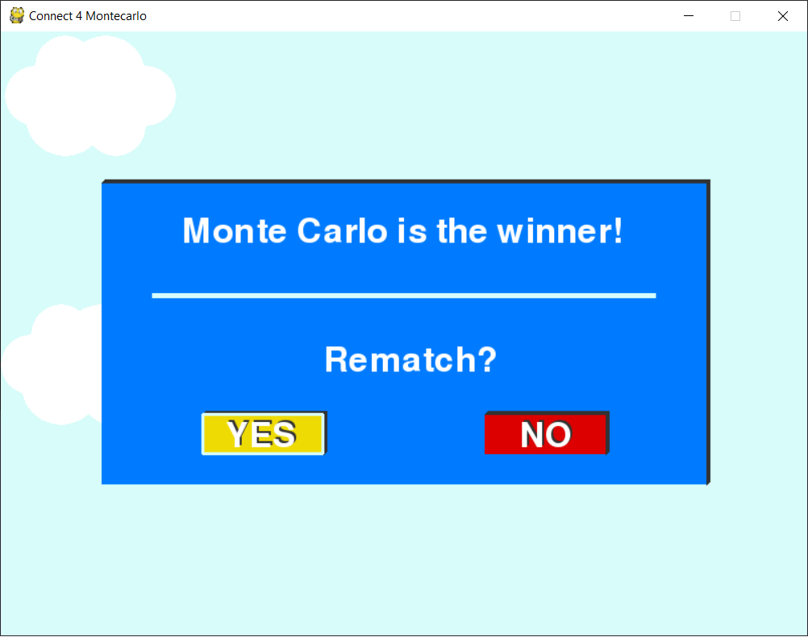

# Connect 4 - AI with Monte Carlo Tree Search (MCTS) Variants

This project implements the classic board game [Connect Four](https://en.wikipedia.org/wiki/Connect_Four) using the Pygame framework. The game is played on a 7×6 grid, and the Artificial Intelligence (AI) opponent utilizes advanced variants of the [Monte Carlo Tree Search](https://en.wikipedia.org/wiki/Monte_Carlo_tree_search) (MCTS) algorithm to make decisions.

The goal is to explore and compare the performance of different MCTS variants, including:

- **MCTS-UCT** (Upper Confidence bounds applied to Trees)
- **MCTS-RAVE** (Rapid Action Value Estimation)
- **MCTS-GRAVE** (Generalized RAVE)
- **MCTS-AMAF** (All Moves As First)

Each variant has unique characteristics that balance exploration and exploitation differently, making them suitable for various scenarios.

---

## Table of Contents
1. [Project Objectives](#project-objectives)  
2. [Overview of Algorithms](#overview-of-algorithms)  
   - [MCTS-UCT](#mcts-uct)  
   - [MCTS-RAVE](#mcts-rave)  
   - [MCTS-GRAVE](#mcts-grave)  
   - [MCTS-AMAF](#mcts-amaf)  
3. [How MCTS Works](#how-mcts-works)  
4. [Performance Evaluation](#performance-evaluation)  
5. [Screenshots](#screenshots)  
6. [License](#license)  

---

## Project Objectives

The main objective of this project is to implement and compare different variants of the Monte Carlo Tree Search (MCTS) algorithm in the context of Connect Four. The focus is on understanding how each variant balances exploration and exploitation and how their performance varies with different computational budgets.

MCTS is particularly interesting because it does not require prior knowledge of the game (unlike Minimax or other heuristic-based algorithms). Instead, it estimates winning probabilities by simulating random games and refining its decision-making process based on the results.

---

## Overview of Algorithms

### MCTS-UCT
- **Description**: The classic MCTS algorithm with Upper Confidence bounds applied to Trees (UCT). It balances exploration and exploitation using the UCT formula.
- **Strengths**: Simple to implement and effective for games with a moderate branching factor.
- **Formula**: UCT = (Q_i / N_i) + C * sqrt(ln(N) / N_i)
- Where:
- `Q_i`: Total reward from node `i`.
- `N_i`: Number of visits to node `i`.
- `N`: Total number of visits to the parent node.
- `C`: Exploration parameter.

### MCTS-RAVE
- **Description**: Rapid Action Value Estimation (RAVE) uses additional information from simulations to speed up convergence. It assumes that moves that are good in one context are likely good in others.
- **Strengths**: Faster convergence in games with many similar states.
- **Formula**: RAVE = Q_i^RAVE / N_i^RAVE
- Where:
- `Q_i^RAVE`: Total reward from all simulations where move `i` was played.
- `N_i^RAVE`: Number of simulations where move `i` was played.

### MCTS-GRAVE
- **Description**: Generalized RAVE (GRAVE) extends RAVE by using a more flexible weighting scheme between the classic MCTS value and the RAVE value.
- **Strengths**: Better performance in games with complex state spaces.
- **Formula**: GRAVE = (1 - β) * UCT + β * RAVE
- Where:
- `β`: Weighting factor between UCT and RAVE.

### MCTS-AMAF
- **Description**: All Moves As First (AMAF) treats all moves in a simulation as if they were played first. This allows for faster sharing of information across the tree.
- **Strengths**: Efficient for games with many overlapping move sequences.
- **Formula**: AMAF = Q_i^AMAF / N_i^AMAF
- Where:
- `Q_i^AMAF`: Total reward from all simulations where move `i` was played at any point.
- `N_i^AMAF`: Number of simulations where move `i` was played at any point.

---

## How MCTS Works

The MCTS algorithm consists of four main steps:

1. **Selection**: Traverse the tree from the root node to a leaf node using a selection policy (e.g., UCT).  
2. **Expansion**: Add one or more child nodes to the tree if the current node is not terminal.  
3. **Simulation**: Play a random game from the selected node to a terminal state.  
4. **Backpropagation**: Update the statistics of all nodes along the path from the selected node to the root.  

This process is repeated until the computational budget (e.g., time or number of simulations) is exhausted.

---

## Performance Evaluation

To evaluate the performance of each algorithm, the following metrics are used:

- **Win Rate**: Percentage of games won against a fixed opponent (e.g., a random player or another MCTS variant).  
- **Time per Move**: Average time taken to compute a move.  
- **Number of Simulations**: Average number of simulations performed per move.  
- **Decision Quality**: Measure of how often the algorithm makes optimal decisions.  

Results are visualized using bar plots, box plots, and convergence curves.

---

## Screenshots

---

## License

This project is licensed under the MIT License. See the [LICENSE](LICENSE) file for details.
